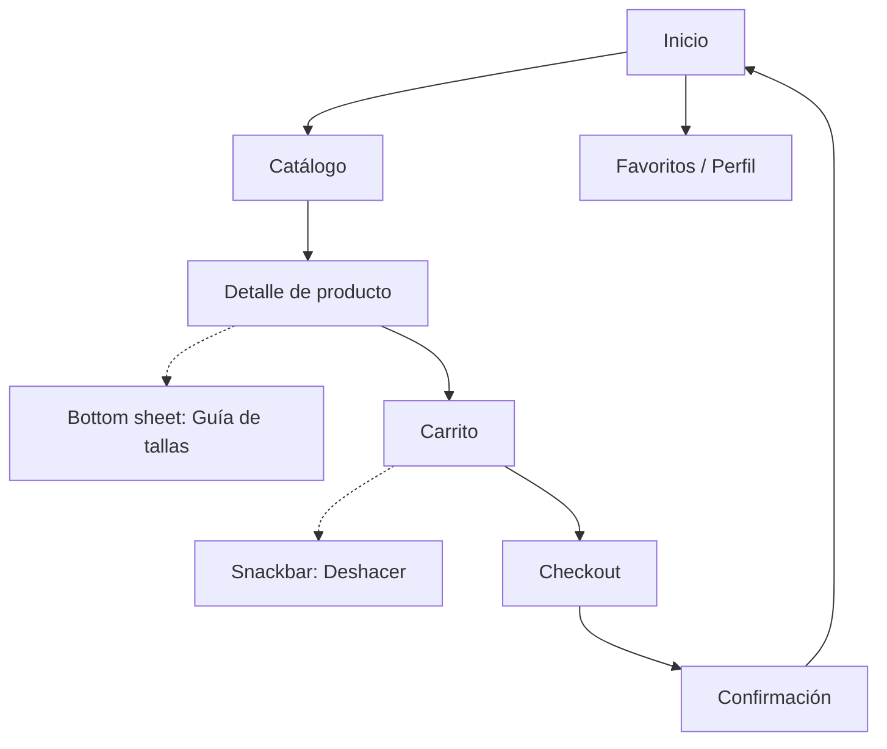

# Documentación de la interfaz — Tiny Steps

## 1. Justificación del diseño

### 1.1 Importancia del diseño centrado en el usuario
Designing for a target audience of busy parents and older people who requires prioritizing speed and clarity. A User-Centered Design approach ensures the interface removes friction from the purchasing process, accommodating users who might be holding a baby with one hand or struggling with confusing sizing charts.

### 1.2 Objetivos y metas del proyecto
1. Enable users to complete a full checkout process in under 2 minutes.
2. Reduce the time spent finding an age-specific product to a maximum of 3 taps.
3. Minimize size-related return rates by integrating an accessible, 1-click size guide on every product page.

### 1.3 Beneficios esperados
* **For the user:** A frustration-free shopping experience that saves time and guarantees accurate sizing.
* **For the business:** Increased conversion rates on mobile devices and a significant reduction in customer support tickets regarding returns and exchanges.

## 2. Investigación y análisis de usuarios

### 2.1 Datos demográficos y segmentación
The primary audience consists of adults aged 25 to 45, specialy parents, balancing work and childcare. 
The secondary audience includes relatives aged 50 to 70, normaly grandparents who purchase gifts but struggle with new technologies and modern children's sizing.

### 2.2 Personas

#### Persona 1: Sarah, Mother
* **Age:** 32
* **Context:** Working mother of a 14-month-old toddler. She usually shops online using her phone during her commute or while the baby is sleeping.
* **Goals:** Restock essential clothes quickly without browsing endlessly.
* **Frustrations:** Apps that require too many steps to filter by age, and confusing checkout forms that reset if she switches apps to answer a message.

#### Persona 2: Robert, Grandfather
* **Age:** 65
* **Context:** Retired. Wants to buy a birthday gift for his 6-year-old granddaughter.
* **Goals:** Find a nice outfit within a specific budget and ensure it fits perfectly.
* **Frustrations:** Small text, hidden menus, and having no idea what "Size 6" actually means in centimeters.

### 2.3 Análisis de la competencia

| App Competidora | Qué hacen bien | Qué hacen mal | Qué me llevo para mi app |
| :--- | :--- | :--- | :--- |
| **Zara** | High-quality imagery and very clean, minimalist aesthetic. | Navigation is overly abstract; finding the children's section takes too many clicks. | Use a clean aesthetic but maintain highly visible, straightforward categories right on the home screen. |
| **H&M** | Excellent filtering system by size, color, and concept. | The product detail pages are overwhelmed with too much text. | Implement horizontal 'filter chips' for quick sorting, but keep the product page focused on the item and the size guide. |
| **Mayoral** | Great sizing information specific to age and months. | The checkout process is tedious and requires creating an account before seeing shipping costs. | Add a highly visible bottom sheet for sizing, and ensure a streamlined, single-page checkout form. |

### 2.4 Insights y hallazgos clave
1. **Insight:** Users often shop with one hand while holding a child. 
   * **Decision:** Place primary navigation and key actions at the bottom of the screen using a Navigation Bar and Bottom Sheets.
2. **Insight:** Grandparents are terrified of buying the wrong size.
   * **Decision:** Implement a prominent "Size Guide" button on the product detail page that opens a clear, easy-to-read overlay rather than redirecting to a new page.
3. **Insight:** Parents abandon carts if the checkout is too long.
   * **Decision:** Design a clean Material Design 3 checkout form with clear error states and visual feedback to prevent user errors.
4. **Insight:** Users are easily overwhelmed by massive catalogs.
   * **Decision:** Display clear, age-based categories directly on the start screen to immediately segment the catalog.

### 3.1 Mapa de navegación

### 3.2 Wireframes

### 3.3 Guía de estilo Material Design 3

**Rejilla (Grid) y Espaciado:**
* **Columnas:** 4
* **Márgenes:** 16 dp
* **Múltiplos:** 8 dp
* **Áreas táctiles mínimas:** 48x48 dp.

**Contraste de color (WCAG AA):**
El Theme Builder asegura los contrastes. Ratios comprobados:
* Primary / On-Primary: > 4.5:1 (Pasa AA)
* Secondary / On-Secondary: > 4.5:1 (Pasa AA)
* Surface / On-Surface: > 7.0:1 (Pasa AAA)
* Error / On-Error: > 4.5:1 (Pasa AA)

    